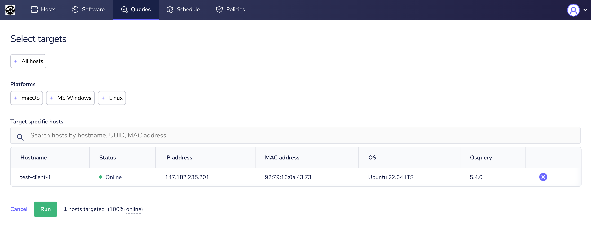

slidenumbers: true

# Protect/hunt/respond with Fleet and osquery


---
# Who we are

We work at Fleet. We like security. And open source.

**Guillaume** -> Head of security @ Fleet - @gepeto42.

**Kathy** -> Developer Advocate @ Fleet - @ksatter_dev 

Find us on the #Fleet channel in the osquery Slack!


---

# Pre-requisites

* Docker
  - Mac and Windows: Desktop
  - Linux: Installed from Docker and not your distro's packages
*  nodeJS (https://nodejs.org/en/download/)
  - Mac: `brew install npm` works too
  - Linux: Recent Ubuntu LTS `apt-get install npm` works too
  - Windows: get it straight from node


---
# Communications

## Slack

For troubleshooting, questions, etc, join the #Fleet channel on the osquery Slack. : https://fleetdm.com/slack

---

## Google Docs running note

https://bit.ly/3QaL3IP


---
# The workshop

Split in 8 "modules"

* Install Fleet
* osquery basics
* osquery SQL basics
* Fleet policies / detecting dangerous configs

---
# The workshop

* Vulnerability identification
* Scheduled queries / gathering data for IR
* Integrations
* Finding badness using MITRE ATT&CK and osquery


---
# Breaks

We aren't monsters, we know it's 9am on DEF CON Thursday.

## 9:45 to 10am -> Break 1 & catch-up 
## 11:30 to 11:45am -> Break 2


---
# Why install Fleet before basics?

We want to be sure everyone is able to get Fleet up to make it easy to query osquery later. 

DO NOT HESITATE to ask questions in person or on Slack - you need a Fleet instance to work!

---
```
┌─────────────────────────────────────────────────────────────────────────────────┐
│                                                                                 │
│          ###                                                                    │
│           #  #    #  ####  #####   ##   #      #      # #    #  ####            │
│           #  ##   # #        #    #  #  #      #      # ##   # #    #           │
│           #  # #  #  ####    #   #    # #      #      # # #  # #                │
│           #  #  # #      #   #   ###### #      #      # #  # # #  ###           │
│           #  #   ## #    #   #   #    # #      #      # #   ## #    #           │
│          ### #    #  ####    #   #    # ###### ###### # #    #  ####            │
│                                                                                 │
│                       #######                                                   │
│                       #       #      ###### ###### #####                        │
│                       #       #      #      #        #                          │
│                       #####   #      #####  #####    #                          │
│                       #       #      #      #        #                          │
│                       #       #      #      #        #                          │
│                       #       ###### ###### ######   #                          │
│                                                                                 │
└─────────────────────────────────────────────────────────────────────────────────┘
```

---
# Local setup

This setup is local and private to you **except** for status logs and scheduled queries.
THIS SETUP IS FOR THE WORKSHOP ONLY NEVER USE THIS "FOR REAL" 


```
┌─────────────────────────────────────────────┐                                
│Docker setup for workshop                    │                                
│ ┌─────┐ ┌─────┐ ┌─────┐  ┌─────┐  ┌─────┐   │       ┌───────────────────────┐
│ │Fleet│ │mysql│ │redis│  │proxy│  │beat │─ ─│─ ─ ─ ─▶graylog1.evil.plumbing │
│ └─────┘ └─────┘ └─────┘  └─────┘  └─────┘   │       └───────────────────────┘
└─────────────────────────────────────────────┘                                
```

---
* Clone the `defcon` branch of Kathy's repo:

`git clone -b defcon https://github.com/ksatter/fleet-docker.git`

* Make sure Docker is installed and running.
* Navigate to the directory `cd fleet-docker`
* Run `docker compose up`

Fleet will accessible at `fleet.traefik.me`

**More instructions in README.md in the repo's defcon branch**

---
# Install `fleetctl`

Command line tool for managing Fleet and generating osquery packages.

0. Install it from the *releases* page https://github.com/fleetdm/fleet/releases

OR 

1. Make sure node is installed and `npm` is available.
2. `sudo npm install -g fleetctl` (On Windows, replace sudo with using an admin `cmd/PowerShell`)


---
```
┌─────────────────────────────────────────────────────────────────────────────────┐
│                                                                                 │
│                                                                                 │
│                ______           __             ___                __            │
│               / ____/__  ____  / /__________ _/ (_)___  ___  ____/ /            │
│              / /   / _ \/ __ \/ __/ ___/ __ `/ / /_  / / _ \/ __  /             │
│             / /___/  __/ / / / /_/ /  / /_/ / / / / /_/  __/ /_/ /              │
│             \____/\___/_/ /_/\__/_/   \__,_/_/_/ /___/\___/\__,_/               │
│                                                                                 │
│                              _____      __                                      │
│                             / ___/___  / /___  ______                           │
│                             \__ \/ _ \/ __/ / / / __ \                          │
│                            ___/ /  __/ /_/ /_/ / /_/ /                          │
│                           /____/\___/\__/\__,_/ .___/                           │
│                                              /_/                                │
│                                                                                 │
│                                                                                 │
│                                                                                 │
└─────────────────────────────────────────────────────────────────────────────────┘
```

---
```
   ┌───────────────────────┐     ┌───────────────────────┐
   │                       │     │                       │
   │                       │     │                       │
   │ fleet1.evil.plumbing  │────▶│graylog1.evil.plumbing │
   │                       │     │                       │
   │                       │     │                       │
   └───────────▲───────────┘     └───────────────────────┘
               │                                          
        ┌──────┴──────┐                                   
┌───────┼─────────────┼───────┐                           
│       │             │       │                           
│  ┌─────────┐   ┌─────────┐  │                           
│  │ osquery │   │ osquery │  │                           
│  └─────────┘   └─────────┘  │                           
│    Pre-built installers     │                           
└─────────────────────────────┘                           
```

---
We also have a centralized Fleet server for everyone to use.

* https://fleet1.evil.plumbing
* Your usernames are on your desks. 
* Password for first logon: DEFCON2022workshop!
* Pre-generated installers point there

1. Log in now and set your password!
2. Generate an installer with `fleetctl` (see Add Hosts, or the shared Docs for full commands)
3. Install the package on a VM **for testing**, without REAL data


---
```
┌─────────────────────────────────────────────────────────────────────────────────┐
│      __________  _________  ______   _____ __  ______________________________   │
│     / ____/ __ \/ ____/   |/_  __/  / ___// / / / ____/ ____/ ____/ ___/ ___/   │
│    / / __/ /_/ / __/ / /| | / /     \__ \/ / / / /   / /   / __/  \__ \\__ \    │
│   / /_/ / _, _/ /___/ ___ |/ /     ___/ / /_/ / /___/ /___/ /___ ___/ /__/ /    │
│   \____/_/ |_/_____/_/  |_/_/     /____/\____/\____/\____/_____//____/____/     │
│                                                                                 │
└─────────────────────────────────────────────────────────────────────────────────┘
```

You now have:

1. A mostly private local Fleet setup.
2. VM(s) pointing to our centralized workshop Fleet server.
3. An account to log in to https://fleet1.evil.plumbing

---
# osquery basics

* Open source, cross-platform agent
* Makes your machine look like an SQL DB
* ~300 different tables

What's running? Who's logged in? What devices are connected? What's connecting? Huge breadth of data.

**Bookmark this** https://osquery.io/schema/

^ When looking at the schema, see you can filter the tables based on which operating system support them. Some tables, for example, the **registry** table, only works on Windows for apparent reasons, and others work on multiple OSes.


---
# How osquery works

* `osqueryi`: terminal/interactive version (or `orbit shell` if installed via orbit)
* `osqueryd` - daemon
* Configured with local files or over TLS
* Logs locally, over TLS (Fleet!) or other outputs.
* If using osquery over TLS, real-time queries can be performed.


---

# What is Fleet?

* [https://github.com/fleetdm/fleet](https://github.com/fleetdm/fleet)

Fleet is the most widely used open source, osquery manager. Deploying osquery with Fleet enables programmable live queries, streaming logs, and effective management of osquery across 100,000+ servers, containers, and laptops. It's handy for talking to multiple devices at the same time.


---
# Installing osquery

Two ways:

1. Regular osquery package + configure to connect to Fleet
2. With Fleet Orbit packages - pre-configured and with automatic updates 😍

You've already done #2!


---
```
┌─────────────────────────────────────────────────────────────────────────────────┐
│              ____  ____  _________    __ __    ____________  _________          │
│             / __ )/ __ \/ ____/   |  / //_/   /_  __/  _/  |/  / ____/          │
│            / __  / /_/ / __/ / /| | / ,<       / /  / // /|_/ / __/             │
│           / /_/ / _, _/ /___/ ___ |/ /| |     / / _/ // /  / / /___             │
│          /_____/_/ |_/_____/_/  |_/_/ |_|    /_/ /___/_/  /_/_____/             │
│                                                                                 │
└─────────────────────────────────────────────────────────────────────────────────┘
```

Resuming in 15m.

If anyone had issues installing Fleet or using `fleetctl` to make packages, perfect time to catch up!


---
# osquery SQL basics

Try these queries either:

1. On your own Fleet.
2. On the centralized Fleet, targeting one of your VMs (to avoid 80 people querying everyone's machines non stop).


---
# Target a single device with a query




---
# What happens in preview mode

1. Fleet server will be run using Docker.
2. A dockerized osquery will be run on your laptop, enrolled to the local Fleet.
3. Simulated Linux hosts will get enrolled to the local Fleet.
4. http://localhost:1337 - `admin@example.com` / `admin123#`


---
# Test it

* Go to **Queries** and then **Create new query**

`SELECT * from osquery_info;`

Run it on one of your VMs. Did you get data back?


---
# SQL in osquery

* Uses SQLite
* Standard SQL

https://osquery.readthedocs.io/en/stable/introduction/sql/


---
# SQL in osquery

Mostly READING from tables. Sometimes just a single table.

`SELECT * FROM users;`

`SELECT * FROM crontab;`

`SELECT * FROM processes;`


^ By the way - using uppercase for SELECT and FROM here is just to make the queries more legible. It would work without that.


---
# Exercise: SQL

1. Look at the osquery schema.
2. Find a way to query a few of those:
  - Is disk encryption enabled? 
  - What Linux kernel modules are loaded? (feel free to query Linux VMs that are not your own if needed)
  - Does the file `/etc/hosts` exist on the system?
  - Are USB devices present?
  - How long have systems been up?


---
# Exercise: SQL - What did you come up with?

Time to look at your examples!

^ `select * from disk_encryption;` (or bitlocker), `kernel_modules`, `SELECT * FROM file WHERE path='/etc/hosts';`


---
# SQL - filter what you need only

* Select only the columns you need: `SELECT username, uid FROM users;`
* Filter with WHERE: `SELECT username, uid FROM users WHERE username = 'guillaume'; 

Which Windows machine on Fleet1 has a user called `guillaume`?

---
# SQL - wirldcards
`
* Wildcards with LIKE: `SELECT column1, column2 FROM table WHERE column2 LIKE '%potato%';`

`%` matches any sequence. `_` matches a single character. For file paths, `%` can be used in a directory: `/etc/%/*.conf`


---
# SQL - you can get advanced!

You can also `SPLIT`, concatenate create temporary tables, essentially do almost anything you could think of doing with SQL. 

```
WITH pstree AS (  
  SELECT 0 as level, pid, name, parent, name as pparent, uid,  cast(uid as varchar(10)) puid       
  FROM processes   WHERE parent = 0  
  UNION ALL
  SELECT level+1 as level, t.pid, t.name, t.parent, pstree.pparent || '->' || t.name as pparent, t.uid, pstree.puid || '->' || t.uid as puid       
  FROM processes t   INNER join pstree on t.parent = pstree.pid )     
SELECT level, pid, name, pparent as process_chain, puid as user_chain  FROM pstree;  
```

(Query available on our centralized server) 

VERY useful to split **registry paths** on Windows!


---
# Processes table

The previously shown query uses the processes table, cross-platform.

`SELECT * FROM processes;`

This is a snapshot of what is happening. 

* How would you find a specific process that you know is running?
* What potential issue could this create if we don't consider that this is a snapshot?


---
# User specific tables

* What Chrome extensions are installed? (or shell history, or Firefox extensions, etc.)

These questions require a "per-user" answer. They have a **UID** column. 

The *users* table also has a **UID** column.

 

---

### Try this

`SELECT * FROM table_with_uids WHERE table_with_uids.uid IN (SELECT uid FROM users);`

Use one of these:
* `chrome_extensions`
*  `firefox_addons` 
* `safari_extensions`


---
# Results

What did you get?

Could you tell precisely what user was related to each entry?

How would you do it? 


---
# List the actual users?

`SELECT users.username, table_with_uids.what_you_want, table_with_uids.what_you_want2 FROM users CROSS JOIN table_with_uids USING (uid);`


---
# Chrome extensions example

Time to make a real one! There are a few ways to achieve it, but the previous example works too.


---
# Chrome extensions example
`SELECT users.username, chrome_extensions.name, chrome_extensions.description FROM users CROSS JOIN chrome_extensions USING (uid);`


---
# Events table

* *file_events* (macOS and Linux)
* *ntfs_journal_events* (Windows)
* *powershell_events* (Windows + requires script block logging)
* *process_events* (macOS and Linux)
* *socket_events*  (macOS and Linux)

And many more!


---
# Try one of the _events tables

Pick one that works with the OS of your host enrolled to Fleet.

Results?


---
# The *osquery_flags* table

osquery flags: configuration - can be passed via TLS, in local config files, or at startup

Fleet manages flags.

`select * from osquery_flags;` to see flags currently applied on a host.


---
# Events flags

`disable-events` must be turned off. 

OS permissions also apply, which is why you are likely getting no results now. In a regular environment, deploy osquery and grant it *full disk access* on macOS: https://fleetdm.com/docs/using-fleet/adding-hosts#grant-full-disk-access-to-osquery-on-mac-os

Then, there are settings per type of events.


---
# On vanilla osqueryi

`osqueryi --audit_allow_config=true --audit_allow_sockets=true --audit_persist=true --disable_audit=false --events_expiry=1 --events_max=50000 --logger_plugin=filesystem --disable_events=false`

This will run an interactive osquery terminal with file, socket and process events enabled.


---
# Generate activity

In another terminal on the same machine (ssh, screen, anything), run a few commands (`ping`, `ls`, `top`, whatever!)

# Go back to your running osqueryi

`select * FROM process_events;`

^ Does everyone have process event results? 


---
# Events and Fleet

* Fleet does not "store" all osquery data (it's not a SIEM!)
* Send them to something such as Firehose to ingest in a SIEM, Graylog, Elastic, Splunk, etc.
* https://fleetdm.com/docs/using-fleet/osquery-logs#firehose


---
# Use cases for events

* Detection and investigation (process_events, process_open_files, etc.)
* File integrity monitoring (FIM) (file_events, ntfs_journal_events)
* Tracking the use of USB storage (hardware_events)


---
# Generating pre-configured osquery installers with fleetctl

* Do this on the machine you installed `fleetctl`.
* Go to your Fleet instance. On **Hosts** - click **Add new hosts**.

You will see the command to generate the package. 

**Warning**: the preview will not listen on all interfaces and you will likely have a hard time adding hosts. Let's generate a package for `nsecfleet2.evil.plumbing` instead!

^ The Docker setup for Fleet preview is not meant to listen to the Internet, does not have proper SSL setup etc. In an actual deployment, this is how you would create your Fleet packages. On macOS, signing and notarization is supported!


---
# My server...

I should be seeing some of your VMs pop-up. 

**DON'T POINT YOUR REAL MACHINE TO THIS** as we will all have access to query it!
Feel free to point Mac VMs, Linux VMs, Windows VMs!

https://nsecfleet2.evil.plumbing:8080
Username: `workshop@evil.plumbing`
Password: `urea-BANDANA-fireside2`


---
# Observer account

As you can see, on my server, you have access to predefined queries at the moment.

**Great** for giving some access for support cases, but without having people have creepy levels of access to endpoints.


---
# What we have so far

1. Local preview instances, with our own laptops enrolled.
2. Random VMs pointed to a centralized server (https://nsecfleet2.evil.plumbing:8080)

We'll refer to these as **preview** and **nsecfleet** instances.


---
# Policies

Policies in Fleet are queries that *pass* or *fail*.

If results are returned, that's a *pass*.

E.g., `SELECT 1 WHERE 1=1;` will always pass.


---
# Making things faster

By default - policies update hourly and the webhooks for integrations once a day.

Let's use `fleetctl` to update that.


---
# Log in with `fleetctl`

1. Configure `fleetctl` to point to your localhost, no HTTPS instance.

`sudo fleetctl config set --address http://localhost:1337 --tls-skip-verify`

2. Log in to the instance.

`sudo fleetctl login`


---
# Applying a config with `fleetctl`

Create a file called `config.yml` with this content:

```yaml
apiVersion: v1
kind: config
spec:
  webhook_settings:
    interval: 1m
```

Or grab it from the Google Drive.


---
# Applying a config with `fleetctl`

`sudo fleetctl apply -f config.yml`

Why is this useful? Make sure you have the correct config, put it in CI/CD pipelines, avoid human error, etc!


---
# What did we change?

`webhook_settings.interval` to one minute instead of 24 hours, so when we configure policy automation, they'll get triggered super fast.


---
# Check the effective config

1. Open dev tools in your browser.
2. Reload
3. Look for `config` - check response data.


---
# Disk encryption

On your **preview** - you should have three policies for disk encryption. 

Do you have hosts passing/failing them?


---
# Firewall

Can you write a policy to check if the firewall is enabled?

Pick the OS you want.

**Tips**:

* Look through the osquery schema
* Use `SELECT 1 FROM` to only return results if a specific condition is passed. (Look at the built-in queries for examples)


---
# Firewall

## macOS
`SELECT 1 FROM alf WHERE global_state >= 1;`
`global_state` could be set to 1 or 2 meaning it's enabled, or enabled and blocking all inbound, and this would pass.


---
# Firewall

## Windows
We do not have a table for firewall status itself, but `windows_security_center` has a firewall column!

`SELECT 1 FROM windows_security_center WHERE firewall='good';`


---
# Unwanted software

Let's make a **negative** policy. One that fails **if** something **is found**.

Assume you hit your head cartoon-style and suddenly started preferring emacs.
You want to detect any use of any package that starts with **vim** on Debian machines (such as the enrolled fake-Linux machines on your **preview**.)

**Tip**: Look at the built-in "SSH Keys encrypted" policy for ideas on making a negative policy.


---
# Unwanted software

`SELECT 1 WHERE NOT EXISTS (SELECT * FROM deb_packages WHERE name LIKE 'vim%');`

1. `deb_packages` table. You can query all of it and see, one of your fake machines should have `vim-tiny` and `vim-common`.
2. We use `WHERE NOT EXISTS` with `SELECT 1` to return results IF the sub-query is empty. So `1` is returned only if nothing that has a name `LIKE` `vim%` is found.


---
# No unencrypted SSH keys

Enable this built-in policy.


---
# Automations

See that manage automations on the top right?

We need something to receive that webhook!


---
# Orchestrator

Fleet works with anything that can receive a webhook.

[Tines.io](https://tines.io) is a nice one with a free trial. 

Create a free account if you want to set up automations.


---
# Policy webhook

In Tines, create a story.

* Drag the "Webhook" action from the top left.
* On the right pane, copy the Webhook URL.
* In Fleet, on the Policies page, click **Manage Automations**.
* Select all policies, and paste the Tines URL at the bottom.
* Save!


---
# Sending fake data
To populate the data structure. Back in the **Manage Automations** pane, bottom left, **Preview Payload**.

Copy the JSON in a text editor.
Go to the Tines **Summary** pane for the **Webhook**, then select **Complex**. 

Copy the first line of the `curl` including the `-d` command **above** the previously copied JSON in a text editor. 


---
# Sending fake data
## Example
`curl -X POST https://bold-lake-4143.tines.com/webhook/13d0deb441fa0427ffc8e771bbb19a66/a94ebc3b2c81ce4db47ae1f69ed707b8 -H "Content-Type: application/json" -d` (JSON goes here between single quotes 'json')

Run it in a terminal from your laptop.

Emit the "held" event in Tines.


---
# Explode the data

Create an **Event Transform** with mode **explode**. Set the path to `receive_policy.webhook.body.hosts`. Autocomplete should work if you sent the fake data and hit the emit button!


---
# Send an email
Add an email action. Configure the text body to use variables like the hostname from the **Event Transform** and the policy name from the webhook!

### The simplest example
Vulnerabilities have a similar webhook, and Tines includes pre-built Fleet actions to query the API for more advanced use cases. E.g., Identify **who** owns a machine and emailing **them** instead of you, Slack messaging, augmenting the data in another story, etc. 


---

# Create a policy to check for unencrypted SSH keys

**Tips**:

1. It can be a negative policy (Remember the `SELECT 1 WHERE NOT EXISTS (other query) trick)
2. You'll need to `JOIN`


---
# Create an unencrypted SSH key

If you are on Mac or Linux.

`ssh-keygen -t rsa -b 4096 -C "your_email@domain.lulz"` -> Make sure you don't overwrite your real keys. But store it in your `.ssh` (e.g., `/Users/g/.ssh/unencrypted_ssh_rsa.pub`)


---
# Policy will fail

The policy will fail. You can hit "refresh" on your host to speed things up. Eventually you should get an email about it.


---
# Fleet in SOAR via REST API

* Postman collection: https://bit.ly/3lo8Yau
* Tines already has pre-built Fleet actions

Use these to augment anything. For example, on policy violation, you could *Get Host to Human Mapping in Fleet* to find the email address of the laptop's owner.

API Token for nsecfleet2: See the Google Drive


---
# Hunting & secure configuration!


## Let's look at ways you can hunt for threats and dangerous configs with osquery & Fleet.

---
# Hunting

1. In the real world, I highly recommend sending *_events* to your centralized logs/SIEM etc.
  - Setting up multiple Fleet instances was already a lot for a 2.5hour workshop, didn't want to add Graylog to it :) 
2. Let's use MITRE ATT&CK for some ideas.


---
# MITRE ATT&CK For Linux

I am using the Linux Matrix - as everyone has Linux machines simulated in the **preview**!

https://attack.mitre.org/matrices/enterprise/linux/

**Execution**: Do you see something in there we could look at (excluding events)?

^ Suggest Scheduled Job Creation - And let's make a scheduled query for cronjobs!


---
# MITRE ATT&CK for all OSes

**Privilege escalation**: *T1543* - Create or modify system process
https://attack.mitre.org/techniques/T1543/

Pick an OS and make an example!

^ macOS: select * from launchd; Windows: select * from register where blablabla path like HKEY_CURRENT_USER\Software\Microsoft\Windows NT\CurrentVersion\Windows\load


--- 
# PowerShell Script Block Logging + osquery

One of the most valuable ways to dig into PowerShell shenanigans. Requires enabling events

First, check if script block logging is enabled!

It's in HKEY_LOCAL_MACHINE\Software\Policies\Microsoft\Windows\PowerShell\ScriptBlockLogging\EnableScriptBlockLogging. How would you query that?

Bonus: turn it into a policy query

^ SELECT 1 FROM registry WHERE path = 'HKEY_LOCAL_MACHINE\Software\Policies\Microsoft\Windows\PowerShell\ScriptBlockLogging\EnableScriptBlockLogging' and data=1;


---
# Scheduling queries to send to centralized logs

1. Come up with a query that would make sense to repeat often.

E.g., What services are running on my Windows servers?

Should not change often!

2. Create query. Save it in Fleet.
3. Schedule query

Note the **performance impact** column.
^  Performance impact is calculated when the query runs on a real machine. Tip: Schedule it to run only on a subset of devices before running it on everything, especially if it's a complicated query that accesses the filesystem a lot.


---
# See all current network connections

How would you look at a snapshot of all network connections?

Then, how would you filter on an IP address IOC? (e.g., 8.8.8.8)


---
# Yara

A great way to look for "freeware"!

1. Can pre-load Yara rules and configure them in the **yara** configuration section (not great for opsec)
2. Can point to URLs
3. Can specify the signature in the query
4. If events are enabled, can run constantly!

For workshop purposes we'll go **inline**.


---
# Yara

1. Download eicar.com on your host running the Fleet preview.

wget https://secure.eicar.org/eicar.com

Warning: On Mac, put it on your home directory, **not** Downloads or Desktop. Those are protected folders the preview osquery can't read.

2. Create a query using the **yara** table and this signature. Don't look at the whole filesystem - too slow for demo purposes. Point it at the directory containing the file.

```yaml
rule eicar {
    strings:
    $s1 = "X5O!P%@AP[4\\PZX54(P^)7CC)7}$EICAR-STANDARD-ANTIVIRUS-TEST-FILE!$H+H*" fullword ascii
    condition:
    all of them
```

3. Convert your query into a policy query


---
# Yara

The query:

```sql
SELECT * FROM yara WHERE path like '/root/%%' AND sigrule IN (
    'rule eicar {
    strings:
    $s1 = "X5O!P%@AP[4\\PZX54(P^)7CC)7}$EICAR-STANDARD-ANTIVIRUS-TEST-FILE!$H+H*" fullword ascii
    condition:
    all of them
}'
) AND matches='eicar';
```


---
# Yara - policy

Make it a negative query so the policy passes if nothing is found!

```sql
SELECT 1 WHERE NOT EXISTS (SELECT * FROM yara WHERE path like '/root/%%' AND sigrule IN (
    'rule eicar {
    strings:
    $s1 = "X5O!P%@AP[4\\PZX54(P^)7CC)7}$EICAR-STANDARD-ANTIVIRUS-TEST-FILE!$H+H*" fullword ascii
    condition:
    all of them
}'
) AND matches='eicar');
```


---
# Yara - production grade

In production, you'd likely not scan the filesystem for malware like this, but either use:

**yara_events**

OR

Match a set of rules against **processes**. Load a standard library locally, then look up new things either live or via URL (opsec warnings go here).


---
# Yara - processes

```sql
SELECT * FROM yara WHERE path IN (SELECT DISTINCT path FROM processes) AND
```

-> Then add your signature group, signature URLs.

### This scans only running processes against a set of yara rules.


---
# Yara - processes
Let's try it with eicar. nothing will match since eicar is not running.

```sql
SELECT * FROM yara WHERE path IN (SELECT DISTINCT path FROM processes) AND sigrule IN (
    'rule eicar {
    strings:
    $s1 = "X5O!P%@AP[4\\PZX54(P^)7CC)7}$EICAR-STANDARD-ANTIVIRUS-TEST-FILE!$H+H*" fullword ascii
    condition:
    all of them
}'
) AND matches='eicar';
```

Notice it was pretty quick to run! Good query to schedule with a decent yara db.


---
# If we have time left...

## Open use case time!

Suggest use cases in Slack. The one that gets the most emoji reactions is the one we'll look at next!


---
# Thank you for your time!

* Fleet channel if you have questions later!

* Twitter: @gepeto42 and @fleetctl

* https://www.pluralsight.com/authors/guillaume-ross 

* Hecklers -> **Detection & Response Block** in Ville-Marie-17h55

* I might host a more advanced version of this workshop with **events** sent to **Graylog** or similar this summer! Stay tuned.

Wallpapers provided by the great Rob Sheridan!


---

# MITRE ATT&CK and osquery for hunting

## https://attack.mitre.org/

We'll pick a few techniques and see how we can hunt for them.

---
# T1053 - Scheduled tasks / Cron jobs

1. Create a query for T1053.002
2. Which Windows machine on Fleet1 has weird scheduled tasks?

---
